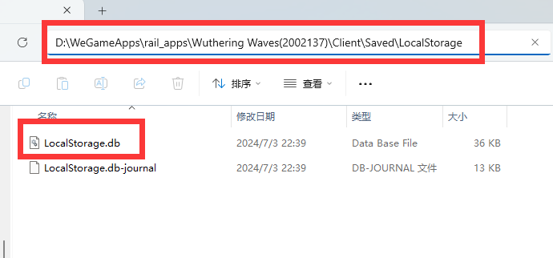

# 鸣潮120FPS解锁器
## 介绍
基于C#的鸣潮帧率解锁器，可以解锁鸣潮的帧率到120FPS。
## 原理
通过C#的Sqlite包，修改鸣潮本地的数据库配置文件，将帧率限制修改为120FPS。
## 使用方法
	1. 打开程序，选择数据库文件路径
	2. 输入你想要的帧率（1-120）
	3. 点击解锁按钮
	4. 启动游戏
## 如何找到数据库文件
	1. 打开鸣潮安装目录，以WeGame版为例，一般在\WeGameApps\rail_apps\Wuthering Waves\Client\Saved\LocalStorage下（官方版应该也大差不差）
	2. 此文件夹下的LocalStorage.db即为数据库文件

## 安全性声明
理论上不会封号，原理是修改本地数据库文件，不会对服务器造成影响。也不会修改游戏内存，介意者慎用。
## 免责声明
本程序仅供学习交流使用，不得用于商业用途，如有侵权请联系删除。

特别感谢B站：新星_Supernova的督促

[关注谢谢喵](https://space.bilibili.com/478004564)